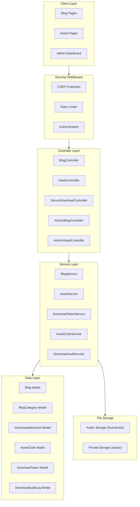

# Design Document: Blog and Downloadable Assets

## Overview

Sistem Blog dan Downloadable Assets untuk platform e-course yang menyediakan CMS untuk artikel dan distribusi produk digital dengan keamanan tinggi. Sistem ini menggunakan arsitektur Laravel + Inertia.js + React yang sudah ada, dengan penambahan layer keamanan khusus untuk download system.

Fokus utama keamanan adalah mencegah:
- **Bypass** - Akses tanpa kode yang valid
- **Injection** - SQL injection, parameter tampering
- **Replay attacks** - Penggunaan ulang token/kode
- **Brute force** - Percobaan kode secara massal

## Architecture



## Components and Interfaces

### 1. Blog Components

#### BlogController (Public)
```php
interface BlogControllerInterface {
    public function index(): Response;           // List published posts
    public function show(string $slug): Response; // Show single post
    public function category(string $slug): Response; // Filter by category
    public function search(Request $request): Response; // Search posts
}
```

#### Admin/BlogController
```php
interface AdminBlogControllerInterface {
    public function index(): Response;
    public function create(): Response;
    public function store(BlogRequest $request): Response;
    public function edit(Blog $blog): Response;
    public function update(BlogRequest $request, Blog $blog): Response;
    public function destroy(Blog $blog): Response;
}
```

#### BlogService
```php
interface BlogServiceInterface {
    public function getPublishedPosts(int $perPage = 10): LengthAwarePaginator;
    public function getPostBySlug(string $slug): ?Blog;
    public function getPostsByCategory(string $categorySlug, int $perPage = 10): LengthAwarePaginator;
    public function searchPosts(string $query, int $perPage = 10): LengthAwarePaginator;
    public function createPost(array $data): Blog;
    public function updatePost(Blog $blog, array $data): Blog;
    public function deletePost(Blog $blog): bool;
}
```

### 2. Asset Components

#### AssetController (Public)
```php
interface AssetControllerInterface {
    public function index(): Response;           // List all assets
    public function show(string $slug): Response; // Show asset detail
    public function requestDownload(Asset $asset): Response; // Request download (free)
    public function redeemCode(RedeemCodeRequest $request, Asset $asset): Response; // Redeem code (paid)
}
```

#### SecureDownloadController
```php
interface SecureDownloadControllerInterface {
    public function download(string $token): BinaryFileResponse;
}
```

#### Admin/AssetController
```php
interface AdminAssetControllerInterface {
    public function index(): Response;
    public function create(): Response;
    public function store(AssetRequest $request): Response;
    public function edit(DownloadableAsset $asset): Response;
    public function update(AssetRequest $request, DownloadableAsset $asset): Response;
    public function destroy(DownloadableAsset $asset): Response;
    public function generateCodes(GenerateCodesRequest $request, DownloadableAsset $asset): Response;
    public function exportCodes(DownloadableAsset $asset): Response;
}
```

### 3. Security Services

#### DownloadTokenService
```php
interface DownloadTokenServiceInterface {
    /**
     * Generate secure download token with HMAC signature
     */
    public function generateToken(
        DownloadableAsset $asset,
        ?User $user,
        string $ipAddress
    ): string;

    /**
     * Validate token and return asset if valid
     */
    public function validateToken(string $token, string $ipAddress): ?DownloadableAsset;

    /**
     * Mark token as consumed (prevent replay)
     */
    public function consumeToken(string $token): bool;
}
```

#### AssetCodeService
```php
interface AssetCodeServiceInterface {
    /**
     * Generate cryptographically secure codes for asset
     */
    public function generateCodes(DownloadableAsset $asset, int $quantity): Collection;

    /**
     * Validate code using constant-time comparison
     */
    public function validateCode(string $code, DownloadableAsset $asset): ValidationResult;

    /**
     * Redeem code with database transaction and row locking
     */
    public function redeemCode(string $code, DownloadableAsset $asset, User $user): RedemptionResult;

    /**
     * Check if user has valid redemption for asset
     */
    public function hasValidRedemption(User $user, DownloadableAsset $asset): bool;
}
```

#### DownloadAuditService
```php
interface DownloadAuditServiceInterface {
    public function logAttempt(
        DownloadableAsset $asset,
        ?User $user,
        string $ipAddress,
        string $userAgent,
        string $action,
        string $result,
        ?string $details = null
    ): DownloadAuditLog;

    public function getFailedAttempts(string $ipAddress, int $minutes = 60): int;
    public function flagSuspiciousActivity(string $ipAddress, string $reason): void;
    public function getLogs(array $filters, int $perPage = 50): LengthAwarePaginator;
}
```

### 4. Rate Limiting Middleware

```php
class AssetRateLimiter
{
    // Code validation: 5 attempts per minute per IP
    public function forCodeValidation(): RateLimiter;
    
    // Download requests: 10 per minute per IP
    public function forDownload(): RateLimiter;
    
    // Cooldown after exceeded: 15 minutes
    public function getCooldownMinutes(): int;
}
```

## Data Models

### Blog Model
```php
class Blog extends Model
{
    protected $fillable = [
        'title',
        'slug',
        'content',
        'excerpt',
        'thumbnail',
        'category_id',
        'author_id',
        'status',        // draft, published
        'published_at',
        'meta_title',
        'meta_description',
    ];

    protected $casts = [
        'published_at' => 'datetime',
    ];
}
```

### BlogCategory Model
```php
class BlogCategory extends Model
{
    protected $fillable = [
        'name',
        'slug',
        'description',
    ];
}
```

### DownloadableAsset Model
```php
class DownloadableAsset extends Model
{
    protected $fillable = [
        'title',
        'slug',
        'description',
        'thumbnail',
        'file_path',           // Stored in private directory
        'file_name',           // Original filename for download
        'file_size',
        'file_type',           // MIME type
        'type',                // free, paid
        'download_count',
        'is_published',
    ];

    protected $casts = [
        'is_published' => 'boolean',
        'download_count' => 'integer',
    ];
}
```

### AssetCode Model
```php
class AssetCode extends Model
{
    protected $fillable = [
        'asset_id',
        'code_hash',           // Hashed code (bcrypt)
        'code_prefix',         // First 4 chars for lookup optimization
        'user_id',
        'is_used',
        'used_at',
        'expires_at',
        'download_count',      // Track re-downloads
        'max_downloads',       // Limit re-downloads (default: 3)
    ];

    protected $casts = [
        'is_used' => 'boolean',
        'used_at' => 'datetime',
        'expires_at' => 'datetime',
    ];

    // Code is never stored in plaintext
    // Only shown once at generation time
}
```

### DownloadToken Model
```php
class DownloadToken extends Model
{
    protected $fillable = [
        'token_hash',          // Hashed token
        'asset_id',
        'user_id',
        'ip_address',
        'nonce',               // Unique per token for replay prevention
        'expires_at',
        'consumed_at',
    ];

    protected $casts = [
        'expires_at' => 'datetime',
        'consumed_at' => 'datetime',
    ];
}
```

### DownloadAuditLog Model
```php
class DownloadAuditLog extends Model
{
    protected $fillable = [
        'asset_id',
        'user_id',
        'ip_address',
        'user_agent',
        'action',              // code_attempt, code_success, download_request, download_complete
        'result',              // success, failed, blocked
        'details',             // JSON with additional context
        'is_suspicious',
    ];

    protected $casts = [
        'details' => 'array',
        'is_suspicious' => 'boolean',
    ];
}
```

## Database Schema

```mermaid
erDiagram
    blogs {
        bigint id PK
        string title
        string slug UK
        text content
        text excerpt
        string thumbnail
        bigint category_id FK
        bigint author_id FK
        enum status
        timestamp published_at
        string meta_title
        text meta_description
        timestamps
    }

    blog_categories {
        bigint id PK
        string name
        string slug UK
        text description
        timestamps
    }

    downloadable_assets {
        bigint id PK
        string title
        string slug UK
        text description
        string thumbnail
        string file_path
        string file_name
        bigint file_size
        string file_type
        enum type
        int download_count
        boolean is_published
        timestamps
    }

    asset_codes {
        bigint id PK
        bigint asset_id FK
        string code_hash
        string code_prefix
        bigint user_id FK
        boolean is_used
        timestamp used_at
        timestamp expires_at
        int download_count
        int max_downloads
        timestamps
    }

    download_tokens {
        bigint id PK
        string token_hash UK
        bigint asset_id FK
        bigint user_id FK
        string ip_address
        string nonce UK
        timestamp expires_at
        timestamp consumed_at
        timestamps
    }

    download_audit_logs {
        bigint id PK
        bigint asset_id FK
        bigint user_id FK
        string ip_address
        text user_agent
        string action
        string result
        json details
        boolean is_suspicious
        timestamps
    }

    blogs ||--o{ blog_categories : belongs_to
    blogs ||--o{ users : author
    downloadable_assets ||--o{ asset_codes : has_many
    downloadable_assets ||--o{ download_tokens : has_many
    downloadable_assets ||--o{ download_audit_logs : has_many
    asset_codes ||--o{ users : redeemed_by
    download_tokens ||--o{ users : belongs_to
    download_audit_logs ||--o{ users : belongs_to
```


## Correctness Properties

*A property is a characteristic or behavior that should hold true across all valid executions of a system—essentially, a formal statement about what the system should do. Properties serve as the bridge between human-readable specifications and machine-verifiable correctness guarantees.*

### Property 1: Blog Visibility Based on Status

*For any* blog post, if its status is "published" then it SHALL appear in public blog queries, and if its status is "draft" then it SHALL NOT appear in public blog queries.

**Validates: Requirements 1.4, 1.5, 2.1**

### Property 2: Blog Category Filter Correctness

*For any* category filter applied to blog queries, all returned posts SHALL belong to that category and no posts from other categories SHALL be included.

**Validates: Requirements 2.3**

### Property 3: Asset Code Uniqueness and Security

*For any* set of generated asset codes, all codes SHALL be unique, and the stored representation SHALL be a cryptographic hash (not plaintext) that cannot be reversed to obtain the original code.

**Validates: Requirements 4.1, 4.3**

### Property 4: Asset Code Format Validation

*For any* generated asset code, it SHALL contain a valid checksum component, and validating the checksum SHALL correctly identify tampered codes.

**Validates: Requirements 4.2**

### Property 5: Paid Asset Access Control

*For any* paid asset, a download request without a valid redeemed code SHALL be rejected, regardless of how the request is constructed.

**Validates: Requirements 3.5, 6.1**

### Property 6: Code Redemption Atomicity

*For any* valid asset code, if two concurrent redemption requests occur, exactly one SHALL succeed and the other SHALL fail, with no possibility of double-redemption.

**Validates: Requirements 6.2, 7.4**

### Property 7: Error Message Uniformity

*For any* invalid code attempt (whether code doesn't exist, is already used, or is for wrong asset), the error response SHALL be identical, revealing no information about the code's status.

**Validates: Requirements 6.5, 9.6**

### Property 8: Download Token Integrity

*For any* download token, modifying any component (user_id, asset_id, timestamp, nonce, or signature) SHALL cause validation to fail.

**Validates: Requirements 5.2, 7.2, 9.1, 9.2**

### Property 9: Download Token Expiry

*For any* download token older than 5 minutes, validation SHALL fail regardless of other token properties being valid.

**Validates: Requirements 5.4, 9.4**

### Property 10: Download Token IP Binding

*For any* download token, validation from an IP address different from the one used during token generation SHALL fail.

**Validates: Requirements 9.5**

### Property 11: Download Token Replay Prevention

*For any* download token that has been successfully used once, subsequent attempts to use the same token SHALL fail.

**Validates: Requirements 9.3**

### Property 12: Rate Limiting Enforcement

*For any* IP address, after 5 failed code validation attempts within 1 minute, subsequent attempts SHALL be blocked for the cooldown period.

**Validates: Requirements 7.1, 7.6**

### Property 13: Path Traversal Prevention

*For any* file path input containing directory traversal sequences (../, ..\, etc.), the request SHALL be rejected before any file system operation.

**Validates: Requirements 8.4**

### Property 14: Audit Log Completeness

*For any* download-related action (code attempt, download request, download complete), an audit log entry SHALL be created containing IP address, user agent, timestamp, action type, and result.

**Validates: Requirements 7.5, 10.1**

### Property 15: Suspicious Activity Flagging

*For any* IP address with more than 10 failed attempts within 1 hour, the system SHALL flag the IP as suspicious for administrator review.

**Validates: Requirements 10.2**

### Property 16: Re-download Window Enforcement

*For any* redeemed code, re-download SHALL be allowed within the configured time window and within the maximum download count limit.

**Validates: Requirements 6.4**

## Error Handling

### Code Validation Errors

| Error Condition | Response | Log Action |
|----------------|----------|------------|
| Invalid code format | 422 "Invalid code format" | Log with details |
| Code not found | 400 "Invalid or expired code" | Log attempt |
| Code already used | 400 "Invalid or expired code" | Log attempt |
| Code for wrong asset | 400 "Invalid or expired code" | Log attempt |
| Rate limit exceeded | 429 "Too many attempts" | Log + flag IP |

### Download Token Errors

| Error Condition | Response | Log Action |
|----------------|----------|------------|
| Invalid token format | 403 Forbidden | Log attempt |
| Token expired | 403 Forbidden | Log attempt |
| Token already used | 403 Forbidden | Log attempt |
| IP mismatch | 403 Forbidden | Log + flag suspicious |
| Invalid signature | 403 Forbidden | Log + flag suspicious |
| Asset not found | 404 Not Found | Log attempt |

### File System Errors

| Error Condition | Response | Log Action |
|----------------|----------|------------|
| File not found | 500 Internal Error | Alert admin |
| Path traversal attempt | 403 Forbidden | Log + flag suspicious |
| Permission denied | 500 Internal Error | Alert admin |

## Testing Strategy

### Unit Tests

Unit tests will cover:
- Blog CRUD operations
- Asset CRUD operations
- Code generation format validation
- Token generation and parsing
- Input sanitization functions
- Path validation functions

### Property-Based Tests

Property-based tests will use **Pest PHP** with **pest-plugin-faker** for data generation. Each property test will run minimum 100 iterations.

Configuration:
```php
// tests/Pest.php
uses()->group('property')->in('Feature/Property');

// Each property test file
it('property test description', function () {
    // Run 100 iterations with random data
})->repeat(100);
```

Property tests will be tagged with format:
```php
/**
 * Feature: blog-downloadable-assets, Property N: [Property Title]
 * Validates: Requirements X.Y
 */
```

### Integration Tests

Integration tests will cover:
- Full download flow (free assets)
- Full redemption + download flow (paid assets)
- Rate limiting behavior
- CSRF protection
- Concurrent redemption handling

### Security Tests

Security-focused tests will cover:
- SQL injection attempts on code input
- Parameter tampering on download requests
- Token replay attacks
- Path traversal attempts
- Brute force simulation

## Security Implementation Details

### Code Generation Algorithm

```php
function generateSecureCode(DownloadableAsset $asset): string
{
    // Format: ASSET-RANDOM-CHECKSUM
    // Example: DL001-X7K9M2P4-A3
    
    $assetPrefix = 'DL' . str_pad($asset->id, 3, '0', STR_PAD_LEFT);
    $random = strtoupper(bin2hex(random_bytes(4))); // 8 chars
    $payload = $assetPrefix . '-' . $random;
    $checksum = strtoupper(substr(hash('crc32', $payload . config('app.key')), 0, 2));
    
    return $payload . '-' . $checksum;
}
```

### Token Generation Algorithm

```php
function generateDownloadToken(
    DownloadableAsset $asset,
    ?User $user,
    string $ipAddress
): string {
    $nonce = bin2hex(random_bytes(16));
    $timestamp = time();
    $userId = $user?->id ?? 0;
    
    $payload = json_encode([
        'a' => $asset->id,
        'u' => $userId,
        'i' => hash('sha256', $ipAddress),
        't' => $timestamp,
        'n' => $nonce,
    ]);
    
    $signature = hash_hmac('sha256', $payload, config('app.key'));
    
    return base64_encode($payload) . '.' . $signature;
}
```

### Constant-Time Code Comparison

```php
function validateCodeHash(string $inputCode, string $storedHash): bool
{
    // Use password_verify for constant-time comparison
    return password_verify($inputCode, $storedHash);
}
```

### Rate Limiter Configuration

```php
// In RouteServiceProvider or dedicated middleware
RateLimiter::for('code-validation', function (Request $request) {
    return Limit::perMinute(5)->by($request->ip());
});

RateLimiter::for('download', function (Request $request) {
    return Limit::perMinute(10)->by($request->ip());
});
```
