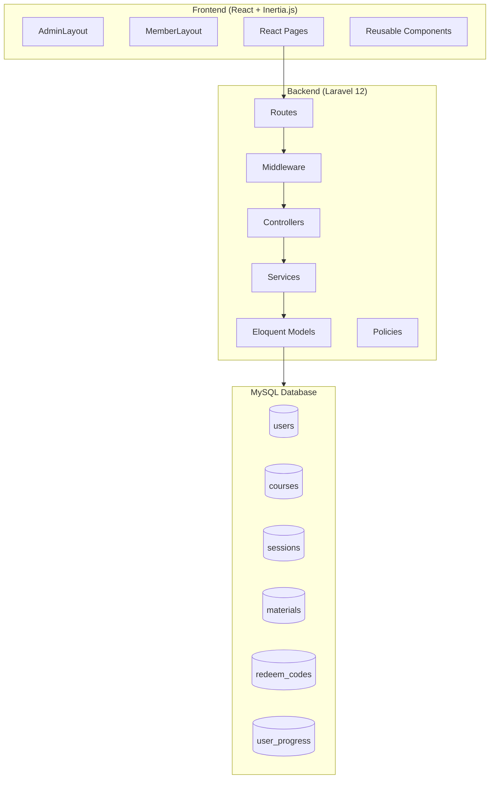
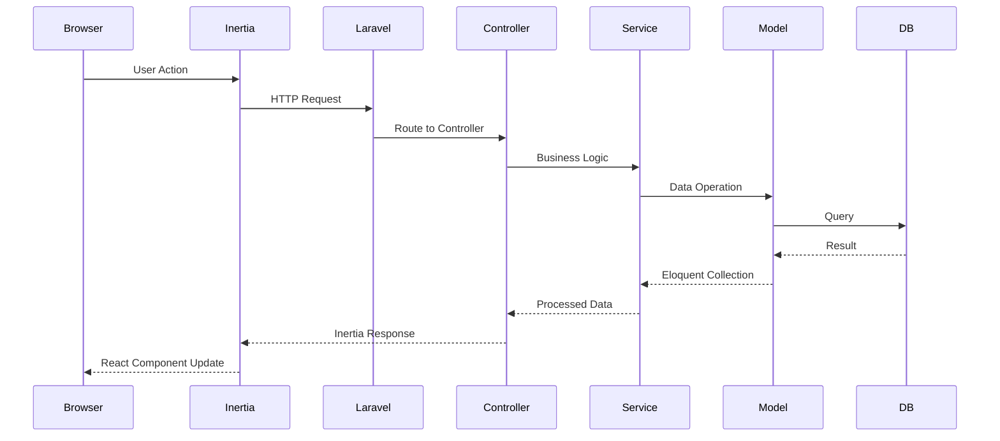
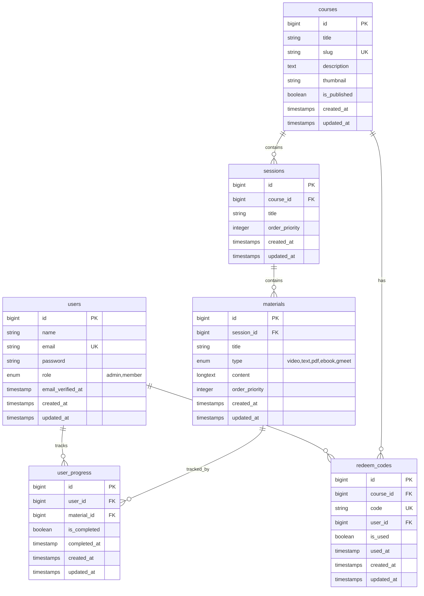

# Design Document: E-Course Platform

## Overview

Platform e-learning dengan arsitektur monolitik menggunakan Laravel 12 sebagai backend, React sebagai frontend melalui Inertia.js, dan Tailwind CSS untuk styling. Sistem mendukung dua role (Admin dan Member) dengan fitur utama: manajemen kursus hierarkis (Course > Session > Material), sistem redeem code unik, dan linear learning dengan progress tracking.

## Architecture

### High-Level Architecture



### Request Flow



## Components and Interfaces

### Backend Components

#### Controllers

```
app/Http/Controllers/
├── Auth/
│   ├── LoginController.php
│   ├── RegisterController.php
│   └── LogoutController.php
├── Admin/
│   ├── DashboardController.php
│   ├── CourseController.php
│   ├── SessionController.php
│   ├── MaterialController.php
│   └── RedeemCodeController.php
└── Member/
    ├── DashboardController.php
    ├── CourseController.php
    ├── MaterialController.php
    ├── RedeemController.php
    └── ProgressController.php
```

#### Services

```php
// CourseService - Manages course operations
interface CourseServiceInterface {
    public function create(array $data): Course;
    public function update(Course $course, array $data): Course;
    public function delete(Course $course): bool;
    public function generateSlug(string $title): string;
}

// RedeemCodeService - Manages redeem code operations
interface RedeemCodeServiceInterface {
    public function generate(Course $course, int $quantity): Collection;
    public function redeem(User $user, string $code): RedeemCode;
    public function validateCode(string $code): bool;
}

// ProgressService - Manages learning progress
interface ProgressServiceInterface {
    public function markComplete(User $user, Material $material): UserProgress;
    public function calculateProgress(User $user, Course $course): float;
    public function canAccessMaterial(User $user, Material $material): bool;
    public function getNextMaterial(User $user, Course $course): ?Material;
}
```

#### Middleware

```php
// AdminMiddleware - Protects admin routes
class AdminMiddleware {
    public function handle(Request $request, Closure $next): Response;
}

// CourseAccessMiddleware - Validates member course access
class CourseAccessMiddleware {
    public function handle(Request $request, Closure $next): Response;
}

// MaterialAccessMiddleware - Validates sequential material access
class MaterialAccessMiddleware {
    public function handle(Request $request, Closure $next): Response;
}
```

### Frontend Components

#### Directory Structure

```
resources/js/
├── app.jsx
├── Layouts/
│   ├── AdminLayout.jsx
│   ├── MemberLayout.jsx
│   └── GuestLayout.jsx
├── Pages/
│   ├── Auth/
│   │   ├── Login.jsx
│   │   └── Register.jsx
│   ├── Admin/
│   │   ├── Dashboard.jsx
│   │   ├── Courses/
│   │   │   ├── Index.jsx
│   │   │   ├── Create.jsx
│   │   │   ├── Edit.jsx
│   │   │   └── Show.jsx
│   │   ├── Sessions/
│   │   │   └── Manage.jsx
│   │   ├── Materials/
│   │   │   └── Manage.jsx
│   │   └── RedeemCodes/
│   │       ├── Index.jsx
│   │       └── Generate.jsx
│   └── Member/
│       ├── Dashboard.jsx
│       ├── Redeem.jsx
│       └── Learn/
│           ├── Course.jsx
│           └── Material.jsx
└── Components/
    ├── VideoPlayer.jsx
    ├── ProgressBar.jsx
    ├── SidebarCourse.jsx
    ├── MaterialContent/
    │   ├── VideoContent.jsx
    │   ├── TextContent.jsx
    │   ├── PdfContent.jsx
    │   ├── EbookContent.jsx
    │   └── GmeetContent.jsx
    └── UI/
        ├── Button.jsx
        ├── Input.jsx
        ├── Card.jsx
        └── Modal.jsx
```

#### Key Component Interfaces

```jsx
// VideoPlayer - Handles YouTube/Vimeo embeds
interface VideoPlayerProps {
    url: string;
    onComplete?: () => void;
}

// ProgressBar - Shows learning progress
interface ProgressBarProps {
    percentage: number;
    showLabel?: boolean;
}

// SidebarCourse - Navigation with lock status
interface SidebarCourseProps {
    sessions: Session[];
    currentMaterialId: number;
    userProgress: UserProgress[];
    onMaterialClick: (materialId: number) => void;
}
```

## Data Models

### Entity Relationship Diagram



### Model Relationships

```php
// User Model
class User extends Authenticatable {
    public function redeemedCodes(): HasMany;
    public function progress(): HasMany;
    public function courses(): BelongsToMany; // Through redeem_codes
    public function isAdmin(): bool;
    public function isMember(): bool;
}

// Course Model
class Course extends Model {
    public function sessions(): HasMany;
    public function redeemCodes(): HasMany;
    public function materials(): HasManyThrough;
    public function enrolledUsers(): BelongsToMany;
}

// Session Model
class Session extends Model {
    public function course(): BelongsTo;
    public function materials(): HasMany;
}

// Material Model
class Material extends Model {
    public function session(): BelongsTo;
    public function progress(): HasMany;
    public function course(): HasOneThrough;
}

// RedeemCode Model
class RedeemCode extends Model {
    public function course(): BelongsTo;
    public function user(): BelongsTo;
}

// UserProgress Model
class UserProgress extends Model {
    public function user(): BelongsTo;
    public function material(): BelongsTo;
}
```


## Correctness Properties

*A property is a characteristic or behavior that should hold true across all valid executions of a system—essentially, a formal statement about what the system should do. Properties serve as the bridge between human-readable specifications and machine-verifiable correctness guarantees.*


### Property 1: User Registration Default Role

*For any* valid registration data, when a user registers, the created user account SHALL have role set to "member".

**Validates: Requirements 1.1**

### Property 2: Role-Based Route Access

*For any* user and any route, if the user has role "admin" they SHALL access /admin/* routes, and if the user has role "member" they SHALL be denied access to /admin/* routes.

**Validates: Requirements 1.3, 1.4**

### Property 3: Course Data Persistence

*For any* valid course data (title, description, thumbnail, is_published), when an admin creates a course, all fields SHALL be stored correctly and a unique slug SHALL be generated from the title.

**Validates: Requirements 2.1, 2.5**

### Property 4: Course Cascade Deletion

*For any* course with sessions, materials, and redeem codes, when the course is deleted, all related sessions, materials, and redeem codes SHALL be removed from the database.

**Validates: Requirements 2.3**

### Property 5: Unpublished Course Visibility

*For any* course with is_published set to false, the course SHALL NOT be visible or accessible to any member user.

**Validates: Requirements 2.4**

### Property 6: Session Cascade Deletion

*For any* session with materials, when the session is deleted, all related materials SHALL be removed from the database.

**Validates: Requirements 3.3**

### Property 7: Ordering by Priority

*For any* course, sessions SHALL be ordered by order_priority ascending. *For any* session, materials SHALL be ordered by order_priority ascending.

**Validates: Requirements 3.2, 3.4, 4.8**

### Property 8: Material Type Validation

*For any* material creation request, the type field SHALL only accept values from the set {video, text, pdf, ebook, gmeet}.

**Validates: Requirements 4.2**

### Property 9: Redeem Code Generation

*For any* redeem code generation request, the generated codes SHALL follow format "PROMO-YYYY-XXXX", be unique across the system, have is_used set to false, and user_id set to null.

**Validates: Requirements 5.1, 5.3, 5.4**

### Property 10: Code Redemption

*For any* valid unused redeem code and member user, when the code is redeemed: is_used SHALL be set to true, user_id SHALL be set to the member's id, used_at SHALL be set to current timestamp, and the course SHALL appear in member's "My Courses" list.

**Validates: Requirements 6.1, 6.2, 6.5**

### Property 11: Sequential Material Access

*For any* member and course, the first material SHALL always be accessible. *For any* material M at position N (N > 1), M SHALL only be accessible if all materials at positions 1 to N-1 are marked as completed.

**Validates: Requirements 7.1, 7.2, 7.3, 7.4, 7.5**

### Property 12: Progress Tracking

*For any* member and course, progress percentage SHALL equal (count of completed materials / total materials) * 100. When a material is marked complete, a user_progress record SHALL be created with is_completed=true and completed_at set to current timestamp.

**Validates: Requirements 8.1, 8.2, 8.4**

### Property 13: Progress Persistence

*For any* member's progress data, the data SHALL persist across user sessions (logout/login cycles).

**Validates: Requirements 8.5**

## Error Handling

### Backend Error Handling

| Error Type | HTTP Status | Response Format |
|------------|-------------|-----------------|
| Validation Error | 422 | `{ errors: { field: [messages] } }` |
| Authentication Error | 401 | `{ message: "Unauthenticated" }` |
| Authorization Error | 403 | `{ message: "Forbidden" }` |
| Not Found | 404 | `{ message: "Resource not found" }` |
| Invalid Redeem Code | 422 | `{ errors: { code: ["Invalid code"] } }` |
| Used Redeem Code | 422 | `{ errors: { code: ["Code already used"] } }` |
| Material Locked | 403 | `{ message: "Complete previous materials first" }` |

### Frontend Error Handling

- Display validation errors inline with form fields
- Show toast notifications for success/error messages
- Handle network errors with retry option
- Redirect to login on 401 responses

## Testing Strategy

### Testing Framework

- **Backend**: PHPUnit (Laravel's default)
- **Property-Based Testing**: phpunit-quickcheck or custom generators
- **Frontend**: Jest + React Testing Library

### Unit Tests

Unit tests will cover:
- Model relationships and accessors
- Service method logic
- Middleware authorization checks
- Controller response formats
- React component rendering

### Property-Based Tests

Property-based tests will validate the 13 correctness properties defined above. Each property test will:
- Generate random valid inputs
- Execute the operation
- Assert the property holds
- Run minimum 100 iterations

Configuration:
```php
// Each property test annotated with:
// @property Feature: ecourse-platform, Property N: [Property Title]
// @validates Requirements X.Y, X.Z
```

### Integration Tests

- Full user registration and login flow
- Course creation with sessions and materials
- Redeem code generation and redemption
- Linear learning progression
- Progress calculation accuracy

### Test Coverage Goals

- Models: 100% coverage
- Services: 100% coverage
- Controllers: 90% coverage
- Middleware: 100% coverage
- React Components: 80% coverage
